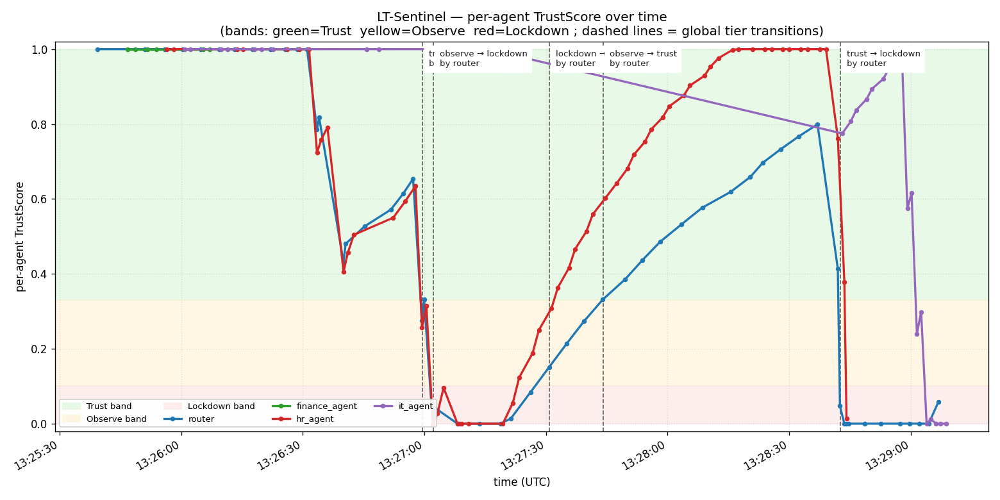

# LT-Sentinel

**This is a layer on top of [Veea Lobster Trap](https://github.com/veeainc/lobstertrap), not a fork. It adds cross-event statistical monitoring (OER, EWMA, CUSUM) to detect long-term / persistent attacks that single-event DPI misses.**

> Lablab.ai TechEx Hackathon — **Track 1: Agent Security & AI Governance** (Powered by Veea Lobster Trap)
> Sponsor positioning Veea published for this track: *"Lobster Trap is the floor, not the ceiling. Use it as the trust layer your project builds on top of, including drift monitoring, multi-agent permission systems, governance dashboards."* — LT-Sentinel is exactly that drift-monitoring + multi-agent-governance layer.

---

## What it does

Lobster Trap (LT) is excellent at **single-event deep prompt inspection**: per-request regex DPI, eight-action policy table, sub-millisecond latency. What it cannot see — because it is stateless by design — is the **shape of an agent's behaviour across many events**:

| Attack class                                | Single event | Cross-event pattern |
|---------------------------------------------|--------------|---------------------|
| **A. Slow / gradual prompt injection**      | each turn looks borderline | OER ramps over many turns |
| **B. Trust-then-burst**                     | agent looks normal for 30 turns, then one extraction attempt | TrustScore drops the moment the burst lands, with full audit trail explaining *why* |
| **C. Slow tool-result poisoning**           | one tainted record looks like noise | repeated near-misses drive EWMA up |

LT-Sentinel sits **next to** LT, with three jobs:

1. **Tail LT's audit log** and maintain a **per-agent** running statistic — OER (chain violation rate), EWMA (Lucas & Saccucci 1990), CUSUM (Page 1954 / Hawkins & Olwell 1998).
2. **Compute a TrustScore** per agent that maps EWMA-OER into a normalised \[0, 1\] band: `TrustScore = clamp(1 − (EWMA_OER − μ) / (3σ), 0, 1)`. Three bands → three tiers (**Trust** ≥ 0.33; **Observe** \[0.10, 0.33\); **Lockdown** < 0.10).
3. **Switch which LT policy is in force** when any agent's TrustScore crosses a threshold. A built-in reverse proxy on `:8080` atomically swings traffic between three pre-warmed LT instances each holding a different policy YAML. Tier change is a pointer flip — **zero downtime, no LT source change**.

Every per-event decision and every tier change is written to JSONL audit logs designed to be **read by a regulator**:

* `sentinel_events.jsonl` — one row per consumed LT entry (`request_id`, `agent_id`, `violation`, `oer_after`, `ewma_after`, `trust_score_after`, `current_tier_global`).
* `sentinel_mode_changes.jsonl` — one row per tier transition with `trigger_agent`, `trigger_trust_score`, `threshold_crossed`, `all_agents_trust_snapshot`, **`recent_violation_events: [request_id, …]`**, `policy_yaml_applied`, `reason_summary`.
* Chained back to LT's own `lt_audit_{trust,observe,lockdown}.jsonl` by `request_id`.

This directly maps to Track 1's Veea bonus criteria: *declared-versus-detected intent mismatches* (LT's native output, surfaced per-agent) and *audit trails a regulator could read* (the dual JSONL + snapshot above).

## Canonical demo result

The chart below is produced by `sentinel/scenarios/demo_run.py` — one Sentinel start, one 153-ingress-event run through the real LangGraph multi-agent system covering all three attack classes:



| Agent | Scenario | Final TrustScore | Final tier | What happened |
|---|---|---|---|---|
| `finance_agent` | (control — never attacked) | 1.000 | trust | flat baseline through every phase |
| `router` | A — slow injection | 0.058 | **lockdown** | Router LLM classifies the slow-injection prompts; its TrustScore descends in tandem with HR (who receives the forwarded payloads) |
| `hr_agent` | B — trust-then-burst | 0.013 | **lockdown** | 15 benign warm-ups, then 4-burst ladder via the router; the first burst is denied by LT (`block_data_exfiltration`), the next three each hit a different lockdown-tier rule |
| `it_agent` | C — slow tool poisoning | 0.000 | **lockdown** | IT calls `fetch_external_calendar` (a deliberately compromised LangGraph tool); 8 escalating payloads returned as real `role:"tool"` messages; turns 5–8 each blocked by a different rule |

Six tier transitions captured in `sentinel_mode_changes.jsonl`, including **two recoveries** — Scenario A drove the system into lockdown, the recovery period rebuilt trust back through observe and trust, then Scenarios B + C drove it down again. Sample tier change record:

```json
{
  "from_tier": "observe",
  "to_tier": "lockdown",
  "trigger_agent": "it_agent",
  "trigger_trust_score": 0.025,
  "threshold_crossed": "τ_low=0.1",
  "all_agents_trust_snapshot": {
    "finance_agent": 1.0, "router": 0.87, "hr_agent": 0.18, "it_agent": 0.025
  },
  "recent_violation_events": ["req-37","req-45","req-53","req-85","req-86","req-88","req-5","req-6","req-7"],
  "policy_yaml_applied": "policy_lockdown.yaml",
  "reason_summary": "it_agent TrustScore=0.025 crossed τ_low=0.1; transitioning observe → lockdown"
}
```

## Architecture

```
user input
   │
   ▼
┌───────────────────────────────────────────────────────────┐
│ lt_agents (LangGraph StateGraph)                           │
│   Router LLM ──► HR / Finance / IT worker                  │
│                       │                                    │
│                       ├──► ToolNode (Chroma RAG)          │
│                       │     └─ role:"tool" reply back     │
│                       └──► worker finalizes               │
└──────────────────┬────────────────────────────────────────┘
                   │ every LLM call: ChatOpenAI(extra_body={"_lobstertrap":{...}})
                   ▼
┌───────────────────────────────────────────────────────────┐
│ LT-Sentinel reverse proxy :8080                            │
│   atomic current_tier_port                                 │
└──────┬───────────────┬───────────────┬────────────────────┘
       │               │               │
       ▼               ▼               ▼
   LT-Trust       LT-Observe      LT-Lockdown
   :18081         :18082          :18083
   policy_trust   policy_observe  policy_lockdown
       │               │               │
       ▼               ▼               ▼  (audit-log JSONL, append-only)
┌───────────────────────────────────────────────────────────┐
│ Sentinel monitor — tail × 3, merge, per-agent             │
│ OER / EWMA / CUSUM / TrustScore, tier decision,           │
│ mode-change record                                         │
└────────────────────┬──────────────────────────────────────┘
                     ▼
    sentinel_events.jsonl + sentinel_mode_changes.jsonl
    + trust_history.jsonl (used by visualize.py)
```

Three LT instances stay up the whole time. Sentinel never reloads LT, never modifies LT source. Tier change is a pointer flip in Sentinel's reverse-proxy. **In-flight requests against the previous tier finish unaffected; new requests instantly route to the new tier's LT.** This is Option C in [`DESIGN.md`](DESIGN.md) §11.5 — chosen because LT has no built-in hot-reload (verified by source read of `cmd/serve.go` and `internal/pipeline/pipeline.go`).

The **agents process** is a single Python program running a LangGraph `StateGraph`: Router classifies user input and dispatches via a conditional edge to one of three workers; each worker has its own Chroma-backed retrieval tool and uses LangChain `bind_tools` so tool returns arrive as real `role:"tool"` messages. Scenario C additionally binds a deliberately compromised `fetch_external_calendar` tool to the IT worker.

## Quickstart

Prerequisites: Go 1.22+, Python 3.10+, Ollama with at least one OpenAI-compatible tool-calling model installed (we use `qwen2.5:7b`).

```bash
# 1) build LT (one time)
cd lobstertrap && go build -o lobstertrap.exe . && cd ..

# 2) install Sentinel + agents
cd sentinel && py -m pip install -e .[viz,dev]

# 3) seed Chroma (one time — downloads the all-MiniLM-L6-v2 embedding model)
py -m lt_agents.cli seed

# 4) start Sentinel (foreground; spawns the 3 LT instances + proxy)
py -m lt_sentinel.cli run
```

In another terminal:

```bash
cd sentinel
# 5a) ad-hoc smoke — single user query through the LangGraph agents
py -m lt_agents.cli ask "What is the PTO carry-over policy?"

# 5b) run the canonical demo (all 3 attack scenarios in sequence)
py -m scenarios.demo_run --qps 2

# 5c) render the chart
py -m scenarios.visualize

# 6) inspect the audit trails
type data/sentinel_mode_changes.jsonl
type data/sentinel_events.jsonl
```

To run baseline calibration from scratch:

```bash
cd sentinel
py -m scenarios.happy_path --n 80
py -m scenarios.calibrate          # writes data/calibration_report.json
```

## Statistical method (citations)

| Parameter | Value | Source |
|---|---|---|
| EWMA λ | 0.05 | Lucas & Saccucci 1990, *Technometrics* 32:1 — range \[0.05, 0.30\]; 0.05 chosen for binary OER signal stability |
| CUSUM k | 0.5 × σ | Page 1954, *Biometrika* 41 + Hawkins & Olwell 1998 |
| CUSUM h | 4 × σ | Hawkins & Olwell 1998 — k=0.5σ + h=4σ ⇒ ARL₀ ≈ 168 |
| Window N | 30 | Münz & Carle 2008, *Traffic Anomaly Detection Using Control Charts* |
| p-chart σ formula | √(μ(1−μ)/N) | Montgomery 2009, *Introduction to Statistical Quality Control* §7.2 |
| TrustScore formula | clamp(1 − (EWMA − μ)/(3σ), 0, 1) | derived from SPC control limits ([`DESIGN.md`](DESIGN.md) §12.2.B) |
| Baseline OER prior | μ = 0.05, σ = 0.040 | low end of Agent Security Bench (ICLR 2025) predicted range; measured μ = 0.0 on N=220 happy-path corroborates that violation judge rejects intent-classifier noise |

Calibration script: `sentinel/scenarios/calibrate.py`. Full method: [`DESIGN.md`](DESIGN.md) §12.

## What's in the repo

```
lablab-techex-track1-lobstertrap/
├── DESIGN.md                   complete design spec (read §11 + §12)
├── CLAUDE.md                   session continuity notes
├── README.md                   this file
├── lobstertrap/                Veea Lobster Trap — read-only, MIT-licensed upstream
│   └── ...                     unmodified
└── sentinel/                   LT-Sentinel + agents (this project)
    ├── pyproject.toml
    ├── README.md               developer guide
    ├── policies/
    │   ├── policy_trust.yaml       6 ingress / 2 egress rules — baseline
    │   ├── policy_observe.yaml    13 ingress / 3 egress rules — heightened
    │   └── policy_lockdown.yaml   14 ingress / 4 egress rules — strict
    ├── src/
    │   ├── lt_sentinel/        — Sentinel runtime (sidecar)
    │   │   ├── config.py           SPC params + tier bindings (all knobs here)
    │   │   ├── violation.py        gray-area judge — §11.9
    │   │   ├── metrics.py          PerAgentState (EWMA / CUSUM / TrustScore)
    │   │   ├── tier_state.py       global tier decision
    │   │   ├── audit_writers.py    JSONL writers for §11.6 audit trail
    │   │   ├── log_tail.py         async multi-file tailer (3 LT audit logs)
    │   │   ├── supervisor.py       lifecycle for the 3 LT instances
    │   │   ├── proxy.py            tier-aware reverse proxy on :8080
    │   │   ├── runtime.py          the wired-up event loop
    │   │   └── cli.py              `lt-sentinel run | show-config | replay`
    │   └── lt_agents/          — LangGraph multi-agent system
    │       ├── identity.py         per-worker declared scopes (router/hr/finance/it)
    │       ├── corpus.py           AcmeCorp seed policy docs (5 HR + 5 Finance + 5 IT)
    │       ├── rag.py              Chroma collections + @tool-decorated retrievers
    │       ├── llm.py              ChatOpenAI factory injecting _lobstertrap extra_body
    │       ├── graph.py            StateGraph: Router → 3 workers → 3 ToolNodes
    │       └── cli.py              `lt-agents ask | seed`
    ├── scenarios/
    │   ├── prompts.py          happy-path query corpora (HR / Finance / IT / Router)
    │   ├── graph_runner.py     thin wrapper that drives the LangGraph for scenarios
    │   ├── poisoned_tool.py    Scenario-C compromised `fetch_external_calendar` tool
    │   ├── happy_path.py       N=80 baseline runner through agents
    │   ├── calibrate.py        offline μ / σ / h / ARL₀ calculator
    │   ├── attack_a_slow_injection.py
    │   ├── attack_b_trust_then_burst.py
    │   ├── attack_c_tool_poisoning.py
    │   ├── demo_run.py         canonical end-to-end demo
    │   └── visualize.py        matplotlib chart of trust_history + transitions
    ├── tests/test_metrics.py   28 unit tests — math + judge regression
    └── data/                   JSONL outputs + chart PNGs + canonical demo dataset
        ├── chroma_seed/        persisted Chroma database (HR / Finance / IT collections)
        └── demo_canonical/     canonical run dataset — gitted for reproducibility
```

## Track 1 evaluation alignment

| Criterion | Where this project lands |
|---|---|
| **Application of Technology** | Uses LT as the floor (Veea's stated positioning) and adds an orthogonal cross-event layer that doesn't reimplement single-event DPI. Multi-process orchestration (3 LT instances + atomic reverse proxy) is a non-trivial deployment pattern. |
| **Originality** | OER from Trust Paradox arxiv:2510.18563; SPC framing (EWMA + CUSUM control charts) borrowed from Münz & Carle 2008's anomaly-detection work and re-anchored to LLM agent governance — that mapping isn't off-the-shelf. |
| **Business Value** | "audit trails a regulator could read" is the literal output: the `sentinel_mode_changes.jsonl` schema includes trigger agent, full snapshot, evidence request_ids, applied policy file, and a human-readable `reason_summary`. |
| **Presentation** | One-pass canonical demo produces a single time-series PNG that visualises 4 agents, 2 tier transitions, and 3 attack classes simultaneously. |
| **Veea bonus** | Native `declared-versus-detected intent mismatches` surfaced per-agent through LT's `_lobstertrap.mismatches` field; cumulative versions caught via OER ramp. |

## What it explicitly is NOT

* not a fork of Lobster Trap (the LT directory in this repo is the upstream MIT-licensed source; we do not modify it)
* not an LT optimisation or replacement
* not a single-event DPI (LT does that)
* not an authentication / user identity system — production deployments need OAuth or mTLS in front of Sentinel; here `_lobstertrap.agent_id` is **declarative** identity for governance purposes
* not a per-identity policy router — current LT policy YAML conditions don't accept `agent_id` as a field, so tier change is global ("连坐制" in DESIGN.md §11.2). Per-identity policy is a future-work item flagged in the README and the design doc.
* not adaptive-attacker-robust — SPC has a known blind spot for adversaries tuning rate just under threshold (DESIGN.md §7.4). Randomised thresholds + RL-based detector are the standard countermeasures; not implemented here.

## License

LT-Sentinel is MIT-licensed (matches Veea Lobster Trap's licence so the combined deployment stays MIT-compliant per lablab submission rules).

## Acknowledgements

* **Veea** for open-sourcing Lobster Trap.
* **The Trust Paradox in LLM-Based Multi-Agent Systems** (arxiv 2510.18563, 2025) for the OER definition.
* **Münz & Carle 2008**, *Traffic Anomaly Detection Using Control Charts* — the SPC-on-network-traffic prior art that we re-applied to LLM agents.
* **Lucas & Saccucci 1990**; **Page 1954**; **Hawkins & Olwell 1998**; **Montgomery 2009** — the SPC literature anchoring every numerical knob.
